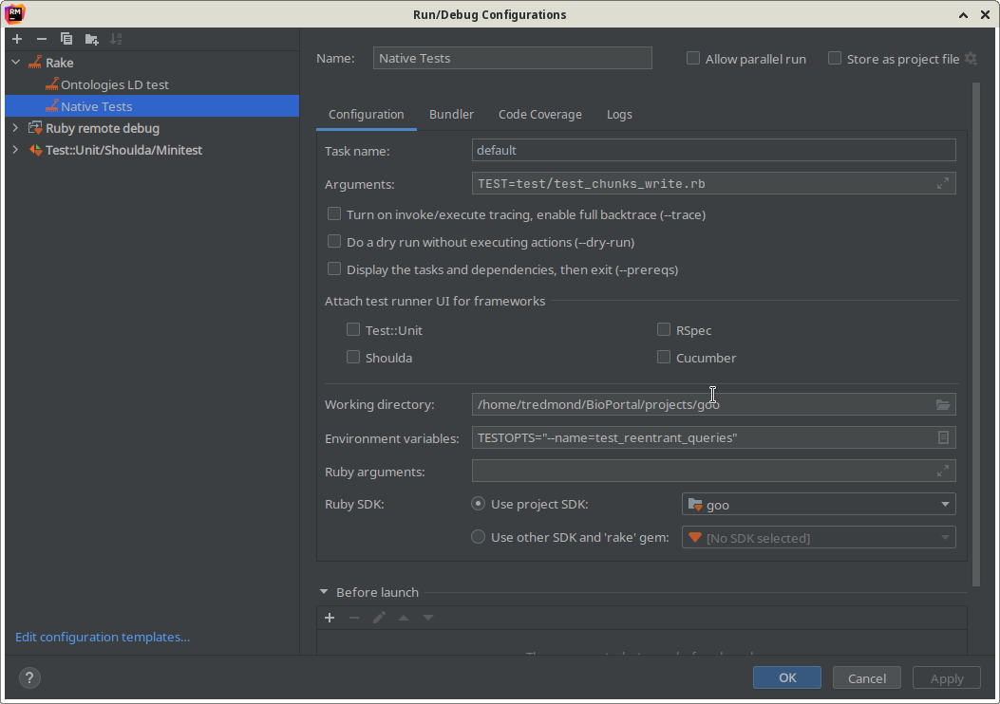

# Debugging BioPortal

The first edition of this guide assumes that one is running Linux and that the IDE of choice is RubyMine.  As more than one person edits this document will become more generic and where it is known it will be indicated that a given solution is RubyMine or Linux specific.I also tend to favour running the Infrastructure in docker to avoid lengthy installs to seeup a developement environment.

## Rbenv and versions of Ruby

Unfortunately, one cannot simply install the latest version of ruby and expect that things would work.  One needs to choose the appropriate version of ruby.  Ruby is too essential to the development to see how to run it only in docker.  Thus it is useful to have a tool that allows one to select and use a specific version of ruby, possibly on a project specific basis.  We often use rbenv for this though there are other tools that are useful (and possibly more secure) for this purpose. A discussion of the installation and use of rbenv can be found [here](https://github.com/rbenv/rbenv/blob/master/README.md).

## Running from the command line with docker

There are many docker-compoee files that create a running infrastructure.  I use the one in the bioportal-config project (which for this purpose  is unfortunately private).  This docker image set provides
+	solr
+	redis
+	memcached
+	mgrep and
+	4store

which is sufficient to run to run all the ReST services of BioPortal.

Now on the command line you should be able to run commands such as

		bundle install
		bundler exec rake

to run the tests.

## Running from RubyMine

Running from RubyMine is, at least in theory, simple once you have the code  One catch which may explain why this is sometimes tricky for me is that you need to be sure that RubyMine is running the same versions of ruby and bundler as the command line environment. The ruby version can be set here:

	Settings->Languages & Frameworks->Ruby SDK and Gems

but I think (maybe) the bundler version needs to be set on the RubyMine command line.

To convince RubyMine to run the program, you need to tell it what to do with a Run/Debug configuration as follows:

This tells RubyMine to run the configuration as a rake task (default) 

### Troubleshooting: Bundler version problems

A key responsibity of the bundler is to define the dependant libraries and to execute things in that context
